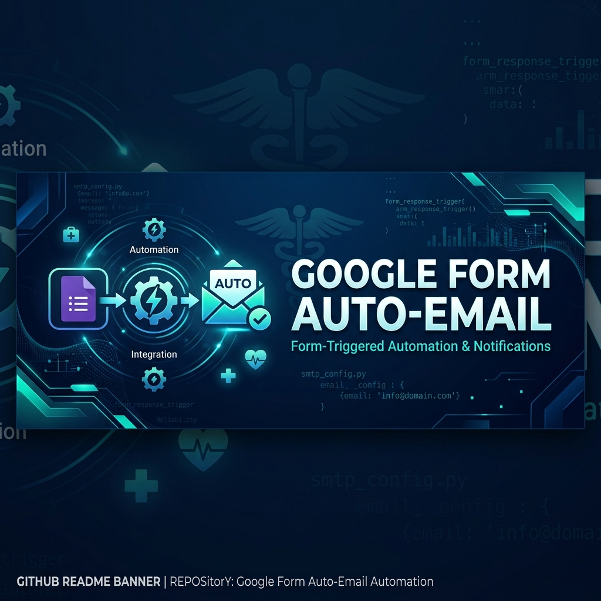
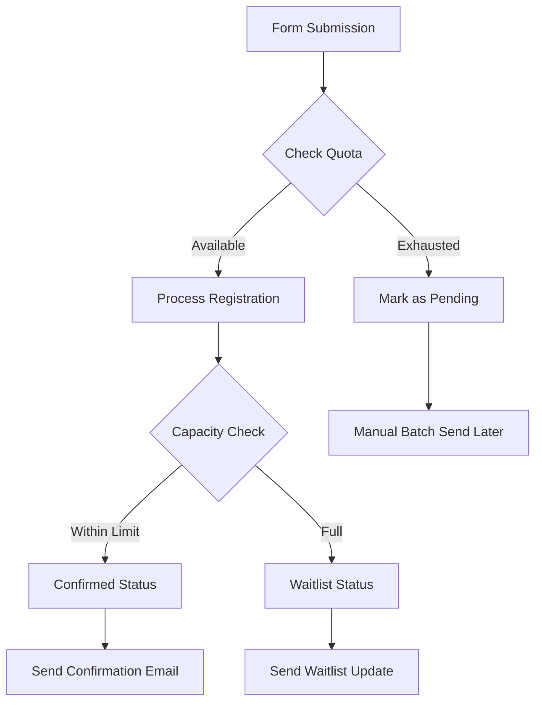

<p align="center">
  
</p>

<h1 align="center">🚀 Google Form Auto-Email Automation</h1>

<p align="center">
  
  
  
  
</p>

<p align="center">
  <a href="https://git.io/typing-svg"></a>
</p>

---

### 📖 Overview
This **Google Apps Script** solution streamlines event registration. It handles ticket limits, manages waitlists dynamically, and sends beautiful HTML email confirmations—all directly from your Google Form responses.

> [!TIP]
> **Developed for MAID 2026** by the **MMI Young Medics** team to ensure a seamless participant experience.

---

### 🔄 How It Works


---

### ✨ Key Features

| 📨 Automated Emails | 📊 Smart Capacity | ⏳ Waitlist Logic |
| :--- | :--- | :--- |
| **Instant Confirmation**: Sends personalized HTML emails to participants immediately after form submission. | **Per-Package Limits**: Automatically tracks and enforces ticket caps for different registration tiers. | **Dynamic Queue**: Once limits are reached, registrants are transitioned to a prioritized waitlist. |

| 🛡️ Error Handling | 🛠️ Admin Tools | ⚡ High Reliability |
| :--- | :--- | :--- |
| **Quota Management**: Detects Google's daily email limits and safely queues pending messages. | **Bulk Send**: Maintenance tools to re-attempt sending for registrations marked as "Pending". | **Self-Healing**: Automatically creates missing status columns in your responses sheet. |

---

### 🛠️ Configuration
The script is powered by a central `CONFIG` object, making it easy to adapt for any event:

```javascript
const CONFIG = {
  FORM_ID: 'your-google-form-id',
  RESPONSE_SHEET_NAME: 'Form Responses 1',
  TICKETS: {
    'Package A': { price: 100, limit: 50, waitlist: 20 },
    // Add more tiers easily
  }
};
```

---

### 🔧 Setup Instructions

<details>
<summary><b>Click to expand setup steps</b></summary>

1.  **Preparation**: Open the Google Sheet linked to your Google Form.
2.  **Script Editor**: Navigate to `Extensions` > `Apps Script`.
3.  **Code Import**: Copy the code from `main.js` into the editor.
4.  **Configuration**: Update the `CONFIG` object with your `FORM_ID` and ticket details.
5.  **Triggers**: 
    *   Click the Clock icon (Triggers) in the left sidebar.
    *   Add a new trigger for `onFormSubmit`.
    *   Event source: `From spreadsheet`.
    *   Event type: `On form submit`.
6.  **Columns**: Ensure your sheet has a `Status` column (the script will try to add it if missing).

</details>

---

<p align="center">
  Built with ❤️ for <b>MMI Young Medics</b>
</p>
